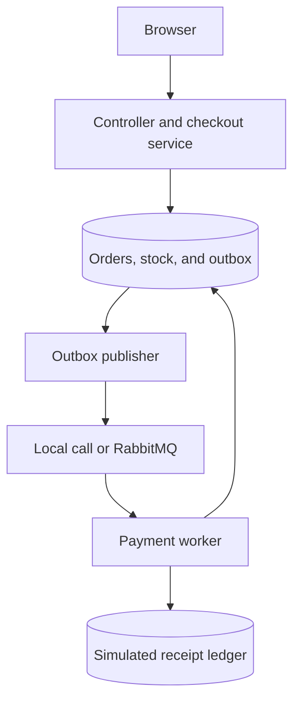
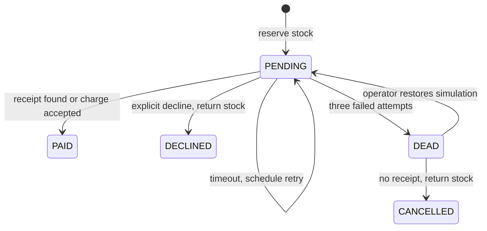

# How the pieces fit together

This is one Spring Boot app with separate areas for HTTP, business rules, SQL, and message delivery. Keeping it in one process makes it easier to debug while still exposing real transaction and concurrency problems.

The two database shapes above are logical areas in **the same database**. The fake receipt ledger is not an independent payment provider.

## Checkout transaction

1. Validate the key and request.
2. Lock the customer's row. This serializes checkouts for that customer across app processes.
3. If the customer already used the key, compare the request details. Return the existing order or reject changed details.
4. Atomically subtract stock if enough is available.
5. Read the server's price and save the order.
6. Save the first outbox event and timeline entry.
7. Commit everything together.

The customer lock is easy to reason about, but reduces parallelism for one very busy customer. A more advanced design can use an idempotency record per key with insert-conflict handling. The database also has a unique `(username, request_key)` constraint as a second line of defence.

## Delivery and retries

The scheduler polls up to 20 due, unsent events every 1.5 seconds. Local mode invokes the same worker directly. Infrastructure mode sends an event ID to a durable RabbitMQ queue, waits for a publisher confirm, checks for an unroutable return, then marks the outbox event sent.

The message body only contains an event ID. Its order and attempt number come from the database. Messages are persistent with the standard Spring string converter. The listener uses automatic acknowledgement after the transactional worker returns.

Multiple publishers may pick up the same unsent row. This implementation intentionally tolerates duplicate sends rather than coordinating a distributed publisher lock. A worker locks the order and processes only its next expected attempt. Duplicate or old deliveries have no business effect. This is at-least-once delivery with idempotent processing, not exactly-once delivery.

Business timeouts create a new outbox row with a later due time. No thread sleeps inside the transaction. Failures stop after three attempts in that recovery cycle. Total attempts remain visible even after manual recovery resets the failure budget.

## Order states

PAID, DECLINED, and CANCELLED are terminal in this version. A repeated message cannot return stock a second time. DEAD retains the reservation because an uncertain payment should not automatically release its item.

## DEAD order versus dead-letter message

These are separate things:

| Condition | Stored where | Recovery |
| --- | --- | --- |
| Simulated provider times out three times | Order status DEAD and timeline | Operator restores provider simulation or cancels after checking receipt |
| Listener throws unexpectedly three times, such as unknown event ID | RabbitMQ `orderflow.dead.queue` | Investigate the message and logs; for a valid pending order, use Redeliver job after fixing the cause |
| Broker unavailable or publish unconfirmed | Unsent outbox row | Publisher tries again on the next poll |

The app does not blindly drain the broker DLQ. An unknown event ID cannot be repaired by retrying it forever. Redeliver only resets the current pending outbox event; it does not acknowledge or remove a broker DLQ message. Inspect and clear resolved broker messages separately.

## What protects the data

- Database transactions make related writes commit or roll back together.
- Conditional stock update and a nonnegative CHECK constraint prevent overselling.
- Customer and order row locks coordinate across app instances sharing a database.
- Unique request keys, order/attempt pairs, and payment/order IDs prevent duplicate records.
- Integer cents avoid floating-point currency rounding.
- Validation limits quantity; checked multiplication rejects numeric overflow.
- Session authentication, CSRF checks, and ownership rules protect API access.
- The frontend uses `textContent` for server data instead of inserting it as HTML.

## Deliberate limits and next design decisions

The fake provider uses our database transaction. A simulated lost reply is saved as a receipt plus a pending retry. If the process crashes halfway through that transaction, both roll back. A separate provider could commit independently; this app does not exercise that physical failure boundary. Extracting the provider is the most useful advanced extension.

Other tradeoffs:

- H2 is convenient but not identical to PostgreSQL. The integration suite repeats the service tests on PostgreSQL.
- One product per order avoids multi-row cart lock ordering for the first version.
- There is no expired-reservation job, refund system, or real payment integration.
- Lists show the latest 100 orders; there is no full pagination yet.
- The outbox and timeline are not pruned. Long-running installations need retention rules.
- The publisher prioritizes simplicity over throughput and retries infrastructure failures each polling cycle.
- One broker and one database do not provide high availability; durable queues alone do not guarantee survival of every infrastructure failure.
- Demo accounts share a configurable password. Do not expose this learning setup as a public store.

## References for deeper reading

- Spring transactions: https://docs.spring.io/spring-framework/reference/data-access/transaction/declarative/annotations.html
- Spring AMQP confirms and returns: https://docs.spring.io/spring-amqp/reference/amqp/template.html
- RabbitMQ acknowledgements: https://www.rabbitmq.com/docs/confirms
- PostgreSQL row locks: https://www.postgresql.org/docs/16/explicit-locking.html

The project pins Spring Boot 3.5.6 to keep its build reproducible. Reference websites may describe newer versions; check the version selector when comparing APIs.
